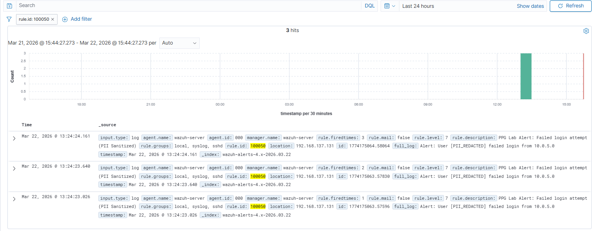

# 🛡️ Building a Privacy-First SOC Pipeline (Personal Privacy Guard)

## 📌 Project Overview

In modern Security Operations Centers (SOCs), balancing network visibility with user privacy is a critical compliance requirement (e.g., GDPR). This project demonstrates the implementation of a **Personal Privacy Guard (PPG)** pipeline.

Instead of sending raw logs directly to the SIEM, logs are intercepted by a Logstash gateway. This gateway uses Regular Expressions (Regex) to detect and redact Personally Identifiable Information (PII)—such as email addresses and specific host IPs—before they are ingested and stored by Wazuh.

### 🎯 Key Objectives

* Differentiate between DLP (Data Loss Prevention) and PPG (Personal Privacy Guard)
* Build an ingestion gateway to sanitize logs in transit
* Configure custom SIEM rules to alert on sanitized data
* Troubleshoot log parsing and network ingestion issues between the Elastic stack and Wazuh

---

## 🏗️ Lab Environment & Architecture

The lab consists of three distinct virtual machines operating on a local subnet:

* **User Workstation (Source):** Alpine Linux (`192.168.137.143`)
* **Privacy Gateway (PPG):** Ubuntu with Logstash (`192.168.137.131`)
* **SIEM / Storage:** Wazuh Pre-installed OVA (`192.168.137.144`)

**Data Flow:**
Alpine Source (TCP 5044) → Ubuntu Logstash (Sanitization) → Wazuh Manager (UDP 514)

---

## 🚀 Step-by-Step Implementation & Verification

---

## Phase 1: Setting Up the SIEM Destination (Wazuh)

Since Wazuh was deployed via a pre-installed OVA, the core installation was handled by the virtualization platform. The goal here is to prepare Wazuh to receive and understand custom remote logs.

### 1️⃣ Enable Remote Syslog Ingestion

By default, Wazuh does not listen for external syslog. Configure it to accept logs strictly from the Logstash gateway.

Edit configuration:

```bash
sudo nano /var/ossec/etc/ossec.conf
```

Add:

```xml
<remote>
  <connection>syslog</connection>
  <port>514</port>
  <protocol>udp</protocol>
  <allowed-ips>192.168.137.131/32</allowed-ips>
</remote>
```

---

### 2️⃣ Create a Custom Detection Rule

Edit local rules:

```bash
sudo nano /var/ossec/etc/rules/local_rules.xml
```

Add:

```xml
<group name="local,syslog,">
  <rule id="100050" level="7">
    <match>failed login from</match>
    <description>PPG Lab Alert: Failed login attempt (PII Sanitized)</description>
  </rule>
</group>
```

Restart Wazuh:

```bash
sudo systemctl restart wazuh-manager
```

---

### ✅ Verify Phase 1

Check listening port:

```bash
sudo ss -uln | grep 514
```

Test custom rule:

```bash
sudo /var/ossec/bin/wazuh-logtest
```

Test string:

```
Alert: User [PII_REDACTED] failed login from 10.0.5.0
```

Confirm rule **100050** triggers.

---

## Phase 2: Setting Up the PPG Gateway (Ubuntu + Logstash)

This server acts as the middleman, intercepting logs and scrubbing PII.

### 1️⃣ Install Logstash

```bash
sudo apt update
sudo apt install openjdk-11-jdk -y
wget -qO - https://artifacts.elastic.co/GPG-KEY-elasticsearch | sudo gpg --dearmor -o /usr/share/keyrings/elastic-keyring.gpg

echo "deb [signed-by=/usr/share/keyrings/elastic-keyring.gpg] https://artifacts.elastic.co/packages/8.x/apt stable main" \
| sudo tee -a /etc/apt/sources.list.d/elastic-8.x.list

sudo apt update
sudo apt install logstash -y
```

---

### 2️⃣ Configure the Redaction Pipeline

Create filter file:

```bash
sudo nano /etc/logstash/conf.d/01-ppg-filter.conf
```

```ruby
input {
  tcp {
    port => 5044
    codec => json { ecs_compatibility => disabled }
  }
}

filter {
  # Redact Email Addresses
  mutate {
    gsub => [ "message", "[\\w\\.-]+@[\\w\\.-]+\\.\\w+", "[PII_REDACTED]" ]
  }

  # IP Anonymization (Hide specific host, keep subnet)
  mutate {
    gsub => [ "message", "(\\d+\\.\\d+\\.\\d+)\\.\\d+", "\\1.0" ]
  }
}

output {
  # Send ONLY cleaned message to Wazuh
  udp {
    host => "192.168.137.144"
    port => 514
    codec => plain { format => "%{message}" }
  }

  # Debug output
  stdout { codec => rubydebug }
}
```

---

### ✅ Verify Phase 2

Test configuration:

```bash
sudo /usr/share/logstash/bin/logstash --config.test_and_exit -f /etc/logstash/conf.d/01-ppg-filter.conf
```

Start service:

```bash
sudo systemctl start logstash
sudo systemctl enable logstash
```

Verify:

```bash
sudo systemctl status logstash
sudo ss -tln | grep 5044
```

---

## Phase 3: Setting Up the Source (Alpine Workstation)

The Alpine machine acts as the endpoint generating sensitive logs. No major installation is required.

---

### ✅ End-to-End Test

From Alpine (`192.168.137.143`):

```bash
echo '{"message": "Alert: User sarah_admin@bank.iq failed login from 10.0.5.22"}' \
| nc 192.168.137.131 5044
```

---

## 🛠️ Challenges & Troubleshooting

### ❌ Issue 1: Logs Dropped by Wazuh

**Symptoms:** Logs sanitized but no alerts in dashboard.

**Cause:** Full JSON forwarded; Wazuh Syslog decoder couldn’t parse it.

**Fix:** Send plain message only:

```ruby
codec => plain { format => "%{message}" }
```

---

## 🏁 Final Results

Original log:

```
Alert: User sarah_admin@bank.iq failed login from 10.0.5.22
```

Sanitized alert in Wazuh:

```
Alert: User [PII_REDACTED] failed login from 10.0.5.0
```

A Level 7 alert is successfully generated while preserving privacy.

---

## 🔮 Future Improvements: Data Pseudonymization

While redaction (`[PII_REDACTED]`) protects privacy, it prevents tracking repeat offenders.

A future enhancement is **pseudonymization** using the Logstash fingerprint filter:

* Hash sensitive fields (e.g., SHA-256)
* Replace email with consistent anonymous ID

Example:

```
sarah_admin@bank.iq → a7b2c9f1...
```

This preserves analyst visibility without exposing identity.

---

## 📸 Screenshots & SOC Dashboard Visuals

### 📊 Wazuh SOC Dashboard Overview

*Screenshot of main dashboard*




---

### 🔍 Alert Details View

*Screenshot showing full alert drill-down and event fields*


